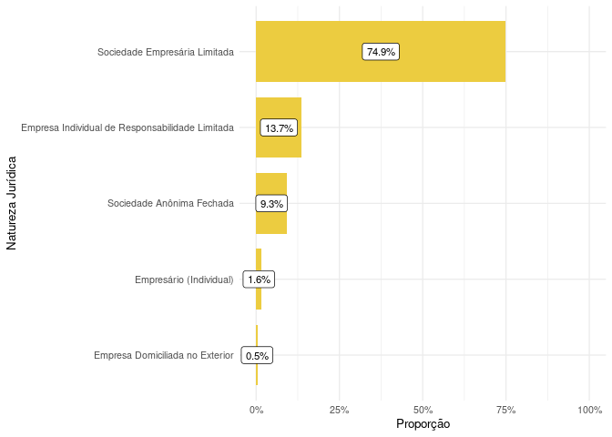

<!-- README.md is generated from README.Rmd. Please edit that file -->

# Análise de Constatação Prévia

Visualizações produzidas para apresentação de projeto no NEPI - Núcleo
de Estudos e Pesquisa em Insolvência (PUC-SP).

A base original foi adquirida pelo estudo do Observatório da
Insolvência: Segunda fase da Associação Brasileira de Jurimetria. A
partir dela foram realizados análises relacionados aos tipos de empresa
e atividade econômicas das partes. Resultando em novas duas bases: A
Base original constavam 122 casos que apresentavam perícia prévia, mas
realizando a classificação manual para a base da análise de perito foram
identificados 18 casos fora do escop (*Esse resultado será considerado
na atualização da base originária*), restando portando 104 processos com
perícia prévia.

Para a análise relacionado às empresas foi considerado a base de dados
da Receita Federal do Brasil (RFB).

#### Casos deferidos e indeferidos porcentagem

| Deferido | Quantidade |      % |
|:---------|-----------:|-------:|
| Não      |         20 |  19.2% |
| Sim      |         84 |  80.8% |
| Total    |        104 | 100.0% |

Quantidade de processos deferidos com perícia prévia

#### Atividades econômicas

| Cnae          | Quantidade |       % |
|:--------------|-----------:|--------:|
| Não informada |         31 |  17.22% |
| Outros        |        149 |  82.78% |
| Total         |        180 | 100.00% |

Atividades econômicas

*Não informadas* no Comprovante de Inscrição e de Situação Cadastral da
receita federal.

#### Gráfico de barras da porcentagem das naturezas jurídicas

#### Resultado da constatação prévia por natureza jurídica

#### Desfechos dos processos com perícia prévia

**Obs:** O processo com o nº processo de **10164223420178260100** foi
retidado na análise das atividades e naturezas jurídicas, afim de evitar
dados que poderiam influenciar os resultados (*Processo consiste em um
litisconsórcio de 30 empresas do meus grupo econômico*).
