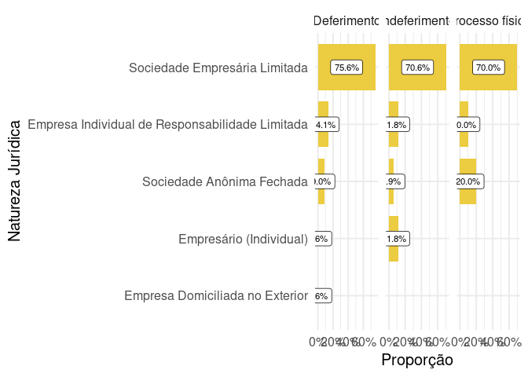

<!-- README.md is generated from README.Rmd. Please edit that file -->

# Análise de Constatação Prévia

Visualizações produzidas para apresentação de projeto no NEPI - Núcleo
de Estudos e Pesquisa em Insolvência (PUC-SP)

#### Casos deferidos e indeferidos porcentagem

| Deferido | Quantidade |      % |
|:---------|-----------:|-------:|
| Não      |         20 |  19.2% |
| Sim      |         84 |  80.8% |
| Total    |        104 | 100.0% |

Quantidade de processos deferidos com perícia prévia

#### Atividades econômicas

| Cnae                                                                                                                                                                    | Quantidade |       % |
|:------------------------------------------------------------------------------------------------------------------------------------------------------------------------|-----------:|--------:|
| Não informada                                                                                                                                                           |         31 |  17.22% |
| Transporte rodoviário de carga, exceto produtos perigosos e mudanças, intermunicipal, interestadual e internacional                                                     |         10 |   5.56% |
| Incorporação de empreendimentos imobiliários                                                                                                                            |          6 |   3.33% |
| Transporte rodoviário coletivo de passageiros, sob regime de fretamento, municipal                                                                                      |          5 |   2.78% |
| Comércio atacadista de mercadorias em geral, com predominância de insumos agropecuários                                                                                 |          4 |   2.22% |
| Holdings de instituições não-financeiras                                                                                                                                |          4 |   2.22% |
| Comércio atacadista de cerveja, chope e refrigerante                                                                                                                    |          3 |   1.67% |
| Comércio atacadista de mercadorias em geral, sem predominância de alimentos ou de insumos agropecuários                                                                 |          3 |   1.67% |
| Construção de rodovias e ferrovias                                                                                                                                      |          3 |   1.67% |
| Fabricação de álcool                                                                                                                                                    |          3 |   1.67% |
| Fabricação de outras máquinas e equipamentos de uso geral não especificados anteriormente, peças e acessórios                                                           |          3 |   1.67% |
| Outras obras de engenharia civil não especificadas anteriormente                                                                                                        |          3 |   1.67% |
| Serviços combinados de escritório e apoio administrativo                                                                                                                |          3 |   1.67% |
| Serviços de engenharia                                                                                                                                                  |          3 |   1.67% |
| Aluguel de imóveis próprios                                                                                                                                             |          2 |   1.11% |
| Comércio a varejo de pneumáticos e câmaras-de-ar                                                                                                                        |          2 |   1.11% |
| Comércio atacadista de produtos alimentícios em geral                                                                                                                   |          2 |   1.11% |
| Comércio por atacado de peças e acessórios novos para veículos automotores                                                                                              |          2 |   1.11% |
| Comércio varejista de artigos do vestuário e acessórios                                                                                                                 |          2 |   1.11% |
| Comércio varejista de combustíveis para veículos automotores                                                                                                            |          2 |   1.11% |
| Fabricação de artefatos de material plástico para outros usos não especificados anteriormente                                                                           |          2 |   1.11% |
| Fabricação de calçados de couro                                                                                                                                         |          2 |   1.11% |
| Fabricação de esquadrias de metal                                                                                                                                       |          2 |   1.11% |
| Fabricação de outras peças e acessórios para veículos automotores não especificadas anteriormente                                                                       |          2 |   1.11% |
| Fabricação de outros produtos de minerais não-metálicos não especificados anteriormente                                                                                 |          2 |   1.11% |
| Fabricação de produtos de trefilados de metal, exceto padronizados                                                                                                      |          2 |   1.11% |
| Fundição de ferro e aço                                                                                                                                                 |          2 |   1.11% |
| Locação de mão-de-obra temporária                                                                                                                                       |          2 |   1.11% |
| Produção de artefatos estampados de metal                                                                                                                               |          2 |   1.11% |
| Transporte rodoviário coletivo de passageiros, com itinerário fixo, municipal                                                                                           |          2 |   1.11% |
| Aluguel de máquinas e equipamentos para construção sem operador, exceto andaimes                                                                                        |          1 |   0.56% |
| Atividades de consultoria em gestão empresarial, exceto consultoria técnica específica                                                                                  |          1 |   0.56% |
| Comércio a varejo de motocicletas e motonetas novas                                                                                                                     |          1 |   0.56% |
| Comércio a varejo de peças e acessórios novos para motocicletas e motonetas                                                                                             |          1 |   0.56% |
| Comércio atacadista de álcool carburante, biodiesel, gasolina e demais derivados de petróleo, exceto lubrificantes, não realizado por transportador retalhista (T.R.R.) |          1 |   0.56% |
| Comércio atacadista de artigos de escritório e de papelaria                                                                                                             |          1 |   0.56% |
| Comércio atacadista de componentes eletrônicos e equipamentos de telefonia e comunicação                                                                                |          1 |   0.56% |
| Comércio atacadista de equipamentos elétricos de uso pessoal e doméstico                                                                                                |          1 |   0.56% |
| Comércio atacadista de outras máquinas e equipamentos não especificados anteriormente; partes e peças                                                                   |          1 |   0.56% |
| Comércio varejista de artigos de viagem                                                                                                                                 |          1 |   0.56% |
| Comércio varejista de materiais de construção não especificados anteriormente                                                                                           |          1 |   0.56% |
| Comércio varejista de móveis                                                                                                                                            |          1 |   0.56% |
| Comércio varejista de outros produtos não especificados anteriormente                                                                                                   |          1 |   0.56% |
| Comércio varejista de vidros                                                                                                                                            |          1 |   0.56% |
| Comércio varejista especializado de instrumentos musicais e acessórios                                                                                                  |          1 |   0.56% |
| Compra e venda de imóveis próprios                                                                                                                                      |          1 |   0.56% |
| Confecção de peças de vestuário, exceto roupas íntimas e as confeccionadas sob medida                                                                                   |          1 |   0.56% |
| Construção de edifícios                                                                                                                                                 |          1 |   0.56% |
| Edição de revistas                                                                                                                                                      |          1 |   0.56% |
| Fabricação de açúcar em bruto                                                                                                                                           |          1 |   0.56% |
| Fabricação de adesivos e selante                                                                                                                                        |          1 |   0.56% |
| Fabricação de adubos e fertilizantes, exceto organo-minerais                                                                                                            |          1 |   0.56% |
| Fabricação de aparelhos e equipamentos para distribuição e controle de energia elétrica                                                                                 |          1 |   0.56% |
| Fabricação de artefatos de material plástico para uso pessoal e doméstico                                                                                               |          1 |   0.56% |
| Fabricação de cabines, carrocerias e reboques para caminhões                                                                                                            |          1 |   0.56% |
| Fabricação de chapas e de embalagens de papelão ondulado                                                                                                                |          1 |   0.56% |
| Fabricação de componentes eletrônicos                                                                                                                                   |          1 |   0.56% |
| Fabricação de embalagens de material plástico                                                                                                                           |          1 |   0.56% |
| Fabricação de equipamentos de transmissão para fins industriais, exceto rolamentos                                                                                      |          1 |   0.56% |
| Fabricação de equipamentos e acessórios para segurança pessoal e profissional                                                                                           |          1 |   0.56% |
| Fabricação de fios, cabos e condutores elétricos isolados                                                                                                               |          1 |   0.56% |
| Fabricação de frutas cristalizadas, balas e semelhantes                                                                                                                 |          1 |   0.56% |
| Fabricação de laminados planos e tubulares de material plástico                                                                                                         |          1 |   0.56% |
| Fabricação de linhas para costurar e bordar                                                                                                                             |          1 |   0.56% |
| Fabricação de máquinas e equipamentos para a agricultura e pecuária, peças e acessórios, exceto para irrigação                                                          |          1 |   0.56% |
| Fabricação de máquinas para a indústria metalúrgica, peças e acessórios, exceto máquinas-ferramenta                                                                     |          1 |   0.56% |
| Fabricação de massas alimentícias                                                                                                                                       |          1 |   0.56% |
| Fabricação de material elétrico e eletrônico para veículos automotores, exceto baterias                                                                                 |          1 |   0.56% |
| Fabricação de móveis com predominância de metal                                                                                                                         |          1 |   0.56% |
| Fabricação de outros aparelhos eletrodomésticos não especificados anteriormente, peças e acessórios                                                                     |          1 |   0.56% |
| Fabricação de outros artefatos e produtos de concreto, cimento, fibrocimento, gesso e materiais semelhantes                                                             |          1 |   0.56% |
| Fabricação de outros produtos de metal não especificados anteriormente                                                                                                  |          1 |   0.56% |
| Fabricação de outros produtos químicos não especificados anteriormente                                                                                                  |          1 |   0.56% |
| Fabricação de periféricos para equipamentos de informática                                                                                                              |          1 |   0.56% |
| Fabricação de produtos de limpeza e polimento                                                                                                                           |          1 |   0.56% |
| Fabricação de produtos de pastas celulósicas, papel, cartolina, papel-cartão e papelão ondulado não especificados anteriormente                                         |          1 |   0.56% |
| Fabricação de produtos de trefilados de metal padronizados                                                                                                              |          1 |   0.56% |
| Fabricação de produtos químicos orgânicos não especificados anteriormente                                                                                               |          1 |   0.56% |
| Fabricação de tratores agrícolas, peças e acessórios                                                                                                                    |          1 |   0.56% |
| Locação de outros meios de transporte não especificados anteriormente, sem condutor                                                                                     |          1 |   0.56% |
| Montagem de estruturas metálicas                                                                                                                                        |          1 |   0.56% |
| Obras de fundações                                                                                                                                                      |          1 |   0.56% |
| Outras atividades de telecomunicações não especificadas anteriormente                                                                                                   |          1 |   0.56% |
| Outras obras de instalações em construções não especificadas anteriormente                                                                                              |          1 |   0.56% |
| Portais, provedores de conteúdo e outros serviços de informação na internet                                                                                             |          1 |   0.56% |
| Preparação de documentos e serviços especializados de apoio administrativo não especificados anteriormente                                                              |          1 |   0.56% |
| Produção de ferroligas                                                                                                                                                  |          1 |   0.56% |
| Provedores de acesso às redes de comunicações                                                                                                                           |          1 |   0.56% |
| Serviços de manutenção e reparação mecânica de veículos automotores                                                                                                     |          1 |   0.56% |
| Serviços de organização de feiras, congressos, exposições e festas                                                                                                      |          1 |   0.56% |
| Serviços de usinagem, tornearia e solda                                                                                                                                 |          1 |   0.56% |
| Tecelagem de fios de algodão                                                                                                                                            |          1 |   0.56% |
| Testes e análises técnicas                                                                                                                                              |          1 |   0.56% |
| Transporte rodoviário coletivo de passageiros, com itinerário fixo, intermunicipal, exceto em região metropolitana                                                      |          1 |   0.56% |
| Total                                                                                                                                                                   |        180 | 100.00% |

Atividades econômicas

*Não informadas* no Comprovante de Inscrição e de Situação Cadastral da
receita federal.

#### Gráfico de barras da porcentagem das naturezas jurídicas

#### Resultado da constatação prévia por natureza jurídica

**Obs:** O processo com o nº processo de **10164223420178260100** foi
retidado na análise das atividades e naturezas jurídicas.
