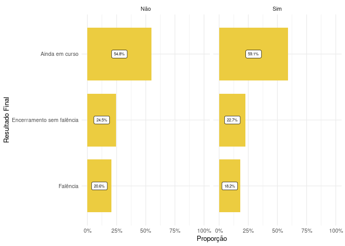

<!-- README.md is generated from README.Rmd. Please edit that file -->

# Análise de Constatação Prévia

Visualizações produzidas para apresentação de projeto no NEPI - Núcleo
de Estudos e Pesquisa em Insolvência (PUC-SP).

A base original foi adquirida pelo estudo do Observatório da
Insolvência: Segunda fase da Associação Brasileira de Jurimetria. A
partir dela foram realizados análises relacionados aos tipos de empresa
e atividade econômicas das partes.

A Base original constavam 122 casos que apresentavam perícia prévia, mas
realizando a classificação manual para a base da análise de perito foram
identificados 18 casos fora do escopo (*Esse resultado será considerado
na atualização da base originária*), restando portando 105 processos com
perícia prévia.

No total de casos coletados pelo Observatório da Fase 2 - Atualização
foram identificados uma porcentagem de 8.79% de casos que tiveram a
constatação prévia:

| Pericia | Quantidade |       % |
|:--------|-----------:|--------:|
| Não     |       1089 |  91.21% |
| Sim     |        105 |   8.79% |
| Total   |       1194 | 100.00% |

Pericia prévia quantidade

Para a análise relacionado às empresas foi considerado a base de dados
da Receita Federal do Brasil (RFB).

#### Casos deferidos e indeferidos porcentagem

| Deferido | Quantidade |      % |
|:---------|-----------:|-------:|
| Não      |         20 |  19.0% |
| Sim      |         85 |  81.0% |
| Total    |        105 | 100.0% |

Quantidade de processos deferidos com perícia prévia

Desses não deferidos:

| Deferido        | Quantidade |      % |
|:----------------|-----------:|-------:|
| Deferimento     |          2 |  10.0% |
| Indeferimento   |         15 |  75.0% |
| Processo físico |          3 |  15.0% |
| Total           |         20 | 100.0% |

Quantidade de processos deferidos com perícia prévia

#### Distribuição dos casos:

| Pericia | Capital | Quantidade |       % |
|:--------|:--------|-----------:|--------:|
| Não     | Não     |        772 |  35.45% |
| Não     | Sim     |        317 |  14.55% |
| Sim     | Não     |         64 |  30.48% |
| Sim     | Sim     |         41 |  19.52% |
| Total   | \-      |       1194 | 100.00% |

Quantos distribuidos na capital

#### Atividades econômicas

| Pericia | Cnae                                                                                                             | Quantidade |       % |
|:--------|:-----------------------------------------------------------------------------------------------------------------|-----------:|--------:|
| Não     | Comércio varejista de artigos do vestuário e acessórios                                                          |         32 |   1.87% |
| Sim     | Comércio varejista de artigos do vestuário e acessórios                                                          |          2 |   0.12% |
| Não     | Comércio varejista de mercadorias em geral com predominância de produtos alimentícios - supermercados            |         46 |   2.69% |
| Não     | Holdings de instituições não financeiras                                                                         |         47 |   2.75% |
| Sim     | Holdings de instituições não financeiras                                                                         |          7 |   0.41% |
| Não     | Incorporação de empreendimentos imobiliários                                                                     |         49 |   2.86% |
| Sim     | Incorporação de empreendimentos imobiliários                                                                     |         18 |   1.05% |
| Não     | Transporte rodoviário de carga exceto produtos perigosos e mudanças intermunicipal interestadual e internacional |         57 |   3.33% |
| Sim     | Transporte rodoviário de carga exceto produtos perigosos e mudanças intermunicipal interestadual e internacional |         11 |   0.64% |
| Não     | Outros                                                                                                           |       1275 |  74.47% |
| Sim     | Outros                                                                                                           |        168 |   9.81% |
| Total   | \-                                                                                                               |       1712 | 100.00% |

Atividades econômicas

#### Proporção dos casos identificados como processos físico

| Resultado da constatação | Quantidade |       % |
|:-------------------------|-----------:|--------:|
| Deferimento              |         83 |  79.05% |
| Indeferimento            |         15 |  14.29% |
| Processo físico          |          7 |   6.67% |
| Total                    |        105 | 100.00% |

Quantidade de processos físicos

#### Proporção de casos que tiveram pedido para complementação de documento

| Desfecho      | Complementação de docs | Quantidade |       % |
|:--------------|:-----------------------|-----------:|--------:|
| Deferimento   | sim                    |         11 |  78.57% |
| Indeferimento | sim                    |          3 |  21.43% |
| Total         | \-                     |         14 | 100.00% |

Complementação de documento

#### Desfechos dos processos

#### Tempos

